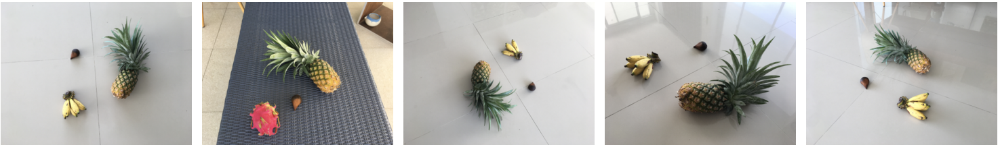
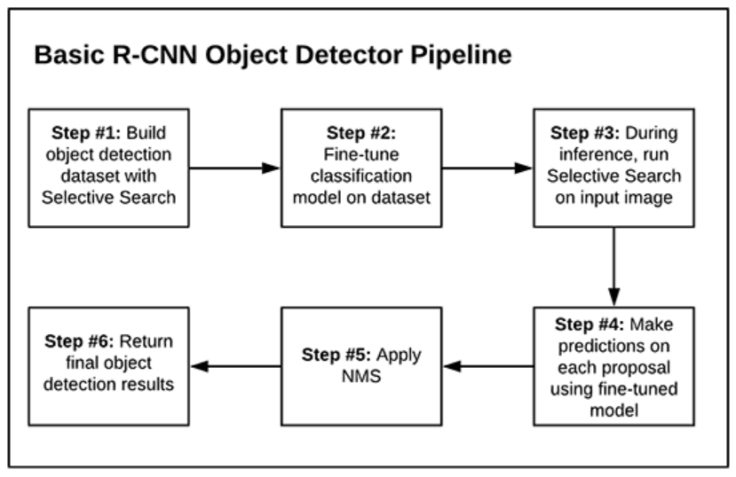
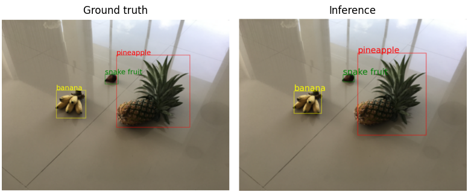

# Region Based Convolutional Neural Networks (RCNN) in Python

- This repository builds an end-to-end multi-class, multi-object image detector using RCNN which is a popular algorithm for object detection.

- Paper: [Rich feature hierarchies for accurate object detection and semantic segmentation](arXiv:1311.2524)

## Requirements
- Python 3
- Pytorch
- Pillow
- Matplotlib
- BeautifulSoup
- tqdm

## Dataset:
- The dataset is from Kaggle: https://www.kaggle.com/datasets/andrewmvd/fruit-detection.
- The data is a set of fruit images. There are 4 types of fruits (Banana, Snake fruit, Dragon fruit, Pineapple), each image includes 3-4 objects.

## RCNN Algorithm Pipeline
- The workflow is follow strickly by the pipeline below: 

- Specifically, in my repository, RCNN algorithm is applied as below:
    + **Step 1**: The Selective Search algorithm is applied on each image to find the proposed ROIs (Region of Interest). After that, these regions are divided into 5 classes ('nothing', 'pineapple', 'snake fruit', 'dragon fruit', 'banana'). The coordinates of bounding box and label of each region are saved.
    + **Step 2**: A fine-tuned EfficientNet model is used to train for image classification problem on above dataset.
    + **Step 3**: At the beginning of inference phase, the Selective Search is applied to find the proposed boxes on infer image.
    + **Step 4**: Next, fine-tuned model trained above is used to predict class of each box.
    + **Step 5**: Apply Non-Maximum Suppression (NMS) algorithm to remove redundant boxes.
    + **Step 6**: Return final object detection results.

- A sample result is described below:

## References
- [RCNN on Raccoon dataset](https://pyimagesearch.com/2020/07/13/r-cnn-object-detection-with-keras-tensorflow-and-deep-learning/)